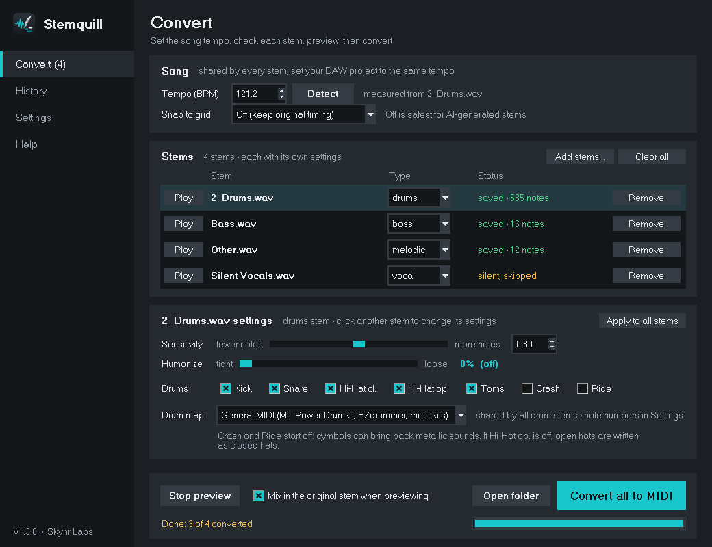

#  Stemquill


[](https://github.com/skynrlabs/Stemquill/releases/latest)
[](https://github.com/skynrlabs/Stemquill/actions/workflows/test.yml)
[](https://github.com/skynrlabs/Stemquill/releases)

[](CONTRIBUTING.md)

> Turn audio stems into MIDI for any DAW.  
> Drums, bass, vocals, keys and synths, ready to play through your own instruments.

<p>
  <a href="https://github.com/skynrlabs/Stemquill/releases/latest"></a>
</p>



---

## What Is Stemquill?

Stemquill is a free desktop tool that listens to an audio stem and writes out what it hears as a MIDI file. Drop in a drum stem and you get kick, snare, hats, toms and cymbals on the right notes for your drum plugin. Drop in a bass or vocal stem and you get the melody line. Guitar, keys and synth stems come out as chords.

Drag the `.mid` file into Waveform, FL Studio, Ableton, Reaper, Logic, Cubase or any other DAW, put your own instrument on it, and the part is yours to play, edit and rework.

---

## 💬 Why Stemquill?

Stem separators are everywhere now, but a stem is still just audio. You can't swap the drum kit, fix one wrong note or change the groove. I wanted a simple way to get from "I have the stem" to "I have the part" so I could rebuild it with my own sounds in my own DAW.

Stemquill is the bridge: audio in, MIDI out, with a preview so you can hear the result before you save it.

---

## ✨ Features

- 🥁 **Full drum kit detection**: kick, snare, closed and open hi-hat, high/mid/low toms, crash and ride
- 🎸 **Melodic stems**: bass and vocal lines as single notes, guitar, keys and synths as chords
- ⏱️ **Tempo detection**: measures the real BPM from a stem so your MIDI lines up with your DAW grid
- ▶️ **Preview before saving**: hear the MIDI with built-in sounds, with the original stem mixed in to check the timing
- 🎚️ **Humanize**: small timing and velocity changes so parts feel played, not programmed
- 🗺️ **Drum maps**: General MIDI (MT Power Drumkit, EZdrummer, Addictive Drums, Superior Drummer), pads in order (FL Studio FPC, Ableton Drum Rack, MPC) or your own custom notes
- 🎛️ **Per-stem settings**: sensitivity, humanize and drums for each stem, with Apply to all
- 📐 **Snap to grid**: keep the original feel or lock notes to 1/8, 1/16 or triplets
- 📦 **Drag and drop**: drop stems or a whole folder onto the window and convert them in one go
- 🧭 **Clean navigation**: sidebar pages and keyboard shortcuts
- 💻 **GUI and command line**: point and click, or script it

---

## 📥 Install

### Windows (recommended)

1. Download **`Stemquill-Setup-x.y.z.exe`** from the [latest release](https://github.com/skynrlabs/Stemquill/releases/latest).
2. Run it and click through the installer. No Python or admin rights needed. On the **Additional tasks** page, keep **Better chord detection** ticked for more accurate chords on guitar, keys and synth stems (it adds about 45 MB).
3. Open **Stemquill** from the Start menu (or the desktop shortcut, if you ticked it).

> Windows may show **"Windows protected your PC"** because the app isn't code-signed yet. Click **More info → Run anyway**.

To update, run the newer installer. To remove, use **Settings → Apps → Stemquill → Uninstall**.

### macOS and Linux

Install with [pipx](https://pipx.pypa.io/) (Python 3.10 or newer):

```bash
pipx install git+https://github.com/skynrlabs/Stemquill.git
stemquill
```

Run `stemquill` with no arguments to open the window, or with file names to use the command line. Update with `pipx upgrade stemquill`.

### Better chord detection (optional)

[basic-pitch](https://github.com/spotify/basic-pitch) improves chords on guitar, keys and synth stems. On Windows, it's the **Better chord detection** box in the installer; run the installer again to add or remove it. With pipx, use Python 3.10 or 3.11:

```bash
pipx install --python python3.11 "stemquill[chords] @ git+https://github.com/skynrlabs/Stemquill.git"
```

### From source (for development)

```bash
git clone https://github.com/skynrlabs/Stemquill.git
cd Stemquill
pip install -e .
python -m stemquill
```

---

## ⚙️ How It Works

Everything happens on the **Convert** page, top to bottom:

1. **Drop your stems** (or a whole folder of them) onto the window, or click **Add stems...** (WAV, MP3, FLAC, AIFF, OGG or M4A). Each stem gets its own row. Its type is read from the file name ("Drums", "Bass", "Vocals", "Other"); change it in the row if needed.
2. **Song:** click **Detect** to measure the tempo from the selected stem, or type the BPM. Tempo and **Snap to grid** are shared by every stem, because it's one song.
3. **Click a stem** to see its own settings underneath: **Sensitivity**, **Humanize** and, for drum stems, which drums to write and the drum map. **Apply to all stems** copies them to the rest.
4. Click **Play** on a stem's row to hear it with built-in sounds; the button turns into **Stop** while it plays. Keep **Mix in the original stem** ticked to check the timing against the real audio.
5. Click **Convert … to MIDI** (it says how many stems). Each row shows when its file is saved as `<name> - <type>.mid`. Change a setting afterwards and the row says **changed · convert again**, so you never drag an out-of-date file into your DAW.

**History** lists everything Detect, Play and Convert did; double-click a saved file to open its folder.

**Settings** holds where files are saved (next to each stem by default), whether the folder opens when converting finishes, the drum note numbers (see [Drum Maps](#-drum-maps)), and **Reset everything to defaults**.

Then set your DAW project to the same tempo and drag each `.mid` onto its instrument track at bar 1.

| Stem type | What you get |
|---|---|
| `drums` | Drum hits on MIDI channel 10, mapped to your drum plugin |
| `bass` | The bass line as single notes |
| `vocal` | The lead vocal melody as single notes |
| `melodic` | Guitar, keys, fiddle and chords (several notes at once) |
| `synth` | Synths and pads (several notes at once) |

### ⌨️ Keyboard shortcuts

| Keys | Action |
|---|---|
| `Ctrl+O` | Add stems |
| `Ctrl+T` | Detect tempo |
| `Ctrl+P` | Preview the selected stem |
| `Esc` | Stop playback |
| `Ctrl+Enter` | Convert to MIDI |
| `Ctrl+1` to `Ctrl+4` | Convert, History, Settings, Help pages |
| `F1` | Help |

---

## 💻 Command Line

For batch jobs and scripts. The command line comes with the pipx and source installs (the Windows app is window-only): use `stemquill` after a pipx install, or `python -m stemquill` from source. Leave out `--bpm` and the tempo is detected for you.

```bash
stemquill "Drums.wav" --type drums --bpm 121 --grid 0 --drum-parts kick,snare,toms
stemquill "Drums.wav" --grid 4 --humanize 30
stemquill "Drums.wav" --bpm 121 --drum-map pads
stemquill "Drums.wav" --bpm 121 --map kick=35,snare=40
stemquill "Bass.wav" "Other.wav" --bpm 121 --grid 0
```

| Option | What it does |
|---|---|
| `--type` | `auto`, `drums`, `bass`, `vocal`, `melodic` or `synth` |
| `--bpm` | Song tempo (detected if left out) |
| `--grid` | Snap steps per beat: `4` = 1/16, `2` = 1/8, `3` = triplets, `0` = off |
| `--sensitivity` | `0.1` (fewer notes) to `1.5` (more notes), default `0.8` |
| `--humanize` | `0` (exact) to `100` (loose) |
| `--drum-parts` | Any of `kick,snare,hihat,openhat,toms,crash,ride` |
| `--drum-map` | `gm` (General MIDI) or `pads` (one pad per drum from note 36) |
| `--map` | Custom notes, e.g. `kick=36,snare=40` |
| `--out` | Folder for the `.mid` files |

---

## 🥁 Drum Maps

| Drum | General MIDI | Pads in order |
|---|---|---|
| Kick | 36 | 36 |
| Snare | 38 | 37 |
| Closed hi-hat | 42 | 38 |
| Open hi-hat | 46 | 39 |
| Low tom | 43 | 40 |
| Mid tom | 45 | 41 |
| High tom | 48 | 42 |
| Crash | 49 | 43 |
| Ride | 51 | 44 |

**General MIDI** works with MT Power Drumkit 2, EZdrummer, Addictive Drums, Superior Drummer, Steven Slate Drums and most drum plugins. **Pads in order** is for pad samplers: load your sounds onto the pads in the order above. Choose **Custom** to type any note, and your map is remembered for next time.

Some DAWs name octaves differently, so the same kick note can show as C1 or C2. It's only a label; the note number is the same.

---

## 💡 Tips

- Automatic transcription is a starting point, not a finished part. Expect to fix some notes, especially toms, ghost notes and busy strumming.
- Cleaner stems give better results. Bleed from other instruments means extra notes.
- AI-generated songs often play at a slightly different tempo than the prompt asked for. Use **Detect** rather than trusting the prompt.
- Crash and Ride start unticked because cymbals can bring back metallic sounds. Turn them on if your stem has clear cymbals.
- Side-stick, bell, china and left/right crash aren't detected, so add them by hand where you want them.
- The preview uses simple placeholder sounds. Your real drum kit or synth will sound much better.

---

## 🩺 Troubleshooting

| Problem | Fix |
|---|---|
| **"Windows protected your PC"** when installing | The app isn't code-signed yet. Click **More info → Run anyway**. |
| MIDI drifts out of time in the DAW | The project tempo doesn't match. Click **Detect** and set your DAW to that exact BPM. If it's half or double what you expect, use the number that matches the song's feel. |
| Too many junk notes | Click the stem and lower its **Sensitivity** (try 0.6); for drums, untick the drums you don't need. |
| Missing quiet notes | Click the stem and raise its **Sensitivity** (try 1.0). |
| Chords look messy or simplified | Make sure **Better chord detection** was ticked when installing (run the installer again to add it). The **History** page says which chord engine was used. |
| Drums land on the wrong sounds | Pick the drum map that matches your plugin (in a drum stem's settings), or type your own note numbers on the **Settings** page. |
| No sound when previewing | Check your output device and volume. If it can't play, the status bar shows where the preview file was saved. |

Still stuck? [Open an issue](https://github.com/skynrlabs/Stemquill/issues) with your settings and, if you can share it, a short clip of the stem.

---

## 📂 Project Structure

```
stemquill/
├── __main__.py          Entry point: `python -m stemquill`
├── cli.py               Command-line options
├── config.py            Drum notes and maps, stem types, saved settings
├── core/                The audio engine (no GUI code, usable from scripts)
│   ├── pipeline.py      One stem: load → transcribe → humanize → save
│   ├── drums.py         Drum hit detection and classification
│   ├── melodic.py       Bass, vocal, guitar, keys and synth notes
│   ├── tempo.py         Tempo detection
│   ├── humanize.py      Timing and velocity feel
│   ├── midi.py          Grid snapping and MIDI file writing
│   └── preview.py       Preview rendering and playback
└── gui/                 The window
    ├── app.py           Main window and shared plumbing
    ├── journeys.py      Convert, Preview and Detect tempo workflows
    ├── pages/           Convert, History, Settings and Help pages
    ├── model.py         Each stem's type, own settings and status
    ├── stems_table.py   The stems list: a row per stem with Play, type and status
    ├── stem_settings.py The selected stem's settings card
    ├── sidebar.py       Left-hand navigation
    ├── action_bar.py    Play, Stop, Convert and status bar
    ├── shortcuts.py     Keyboard shortcuts
    ├── dialogs.py       About dialog
    ├── widgets.py       Shared building blocks
    └── theme.py         Colours, fonts and styles
stemquill/assets/        App icon (SVG source, PNGs and Windows .ico)
tests/                   Tests with synthetic stems (pytest), incl. window tests
packaging/               Windows build: PyInstaller spec and Inno Setup installer
.github/workflows/       Lint and tests on Linux; builds and tests the Windows installer
docs/                    README screenshot
```

The engine can be used from your own scripts:

```python
from stemquill.core import convert, detect_tempo

bpm = detect_tempo("Drums.wav")
convert("Drums.wav", "drums", bpm=bpm, humanize_amount=0.3)
```

---

## 🛠️ Tech Stack

| | |
|---|---|
| Language | Python 3.10+ |
| UI | Tkinter |
| Audio analysis | librosa, NumPy, SciPy |
| MIDI | mido |
| Chord detection (optional) | basic-pitch on ONNX Runtime |
| Windows app | PyInstaller + Inno Setup, built by GitHub Actions |

---

## 🔐 Privacy

Stemquill runs entirely on your computer. Your audio is never uploaded anywhere. The only file it writes besides your MIDI is a small `settings.json` that remembers your drum map, stored in `%APPDATA%\Stemquill` on Windows, `~/Library/Application Support/Stemquill` on macOS or `~/.config/stemquill` on Linux.

---

## 💚 Support Stemquill

Stemquill is free and open source, made by one person. If it saves you time, you can pay what you want for it on [itch.io](https://skynrlabs.itch.io/stemquill), or sponsor Skynr Labs on [GitHub Sponsors](https://github.com/sponsors/skynrlabs). It helps pay for code signing (so Windows stops warning about the installer) and keeps new features coming. Starring the repo and sharing it with other producers helps too.

---

## 🤝 Contributing

PRs and issues are welcome. See [CONTRIBUTING.md](CONTRIBUTING.md) for guidelines, including how releases are published.

The repo uses a two-branch model:

| Branch | Purpose |
|---|---|
| `main` | Stable, release-ready |
| `dev` | Integration target — all PRs merge here first |

## 📄 License

Stemquill is open-source software licensed under the **MIT License**. Copyright © 2026 Skynr Labs.

You are free to use, modify, and distribute this software, including in commercial projects, as long as the copyright notice is kept. See [LICENSE](LICENSE) for full terms.

---

Made by [Skynr Labs](https://github.com/skynrlabs) &nbsp;·&nbsp; [GitHub Sponsors](https://github.com/sponsors/skynrlabs)
