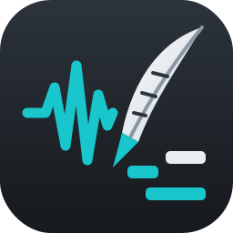

# 🪶 Stemquill


[](CONTRIBUTING.md)

> Turn audio stems into MIDI for any DAW.  
> Drums, bass, vocals, keys and synths, ready to play through your own instruments.


---

## What Is Stemquill?

Stemquill is a free desktop tool that listens to an audio stem and writes out what it hears as a MIDI file. Drop in a drum stem and you get kick, snare, hats, toms and cymbals on the right notes for your drum plugin. Drop in a bass or vocal stem and you get the melody line. Guitar, keys and synth stems come out as chords.

Drag the `.mid` file into Waveform, FL Studio, Ableton, Reaper, Logic, Cubase or any other DAW, put your own instrument on it, and the part is yours to play, edit and rework.

---

## 💬 Why Stemquill?

Stem separators are everywhere now, but a stem is still just audio. You can't swap the drum kit, fix one wrong note or change the groove. I wanted a simple way to get from "I have the stem" to "I have the part" so I could rebuild it with my own sounds in my own DAW.

Stemquill is the bridge: audio in, MIDI out, with a preview so you can hear the result before you save it.

---

## ✨ Features

- 🥁 **Full drum kit detection**: kick, snare, closed and open hi-hat, high/mid/low toms, crash and ride
- 🎸 **Melodic stems**: bass and vocal lines as single notes, guitar, keys and synths as chords
- ⏱️ **Tempo detection**: measures the real BPM from a stem so your MIDI lines up with your DAW grid
- ▶️ **Preview before saving**: hear the MIDI with built-in sounds, with the original stem mixed in to check the timing
- 🎚️ **Humanize**: small timing and velocity changes so parts feel played, not programmed
- 🗺️ **Drum maps**: General MIDI (MT Power Drumkit, EZdrummer, Addictive Drums, Superior Drummer), pads in order (FL Studio FPC, Ableton Drum Rack, MPC) or your own custom notes
- 🎛️ **Sensitivity control**: slider or typed value to catch quiet notes or cut junk notes
- 📐 **Snap to grid**: keep the original feel or lock notes to 1/8, 1/16 or triplets
- 📦 **Batch convert**: drop in a whole set of stems and convert them in one go
- 🧭 **Clean navigation**: sidebar pages, a full menu bar and keyboard shortcuts
- 💻 **GUI and command line**: point and click, or script it

---

## ⚙️ How It Works

1. Click **Add stems...** and pick your audio files (WAV, MP3, FLAC and more). The stem type is read from the file name ("Drums", "Bass", "Vocals", "Other").
2. Click **Detect** to measure the tempo, or type the BPM you know.
3. Click **Play** to preview the MIDI. Adjust sensitivity, drums or humanize and play again until it sounds right.
4. Click **Convert to MIDI**. Each stem becomes `<name> - <type>.mid` next to the original.
5. Set your DAW project to the same tempo and drag the `.mid` onto your instrument track at bar 1.

| Stem type | What you get |
|---|---|
| `drums` | Drum hits on MIDI channel 10, mapped to your drum plugin |
| `bass` | The bass line as single notes |
| `vocal` | The lead vocal melody as single notes |
| `melodic` | Guitar, keys, fiddle and chords (several notes at once) |
| `synth` | Synths and pads (several notes at once) |

### ⌨️ Keyboard shortcuts

| Keys | Action |
|---|---|
| `Ctrl+O` | Add stems |
| `Ctrl+T` | Detect tempo |
| `Ctrl+P` | Preview |
| `Esc` | Stop preview |
| `Ctrl+Enter` | Convert to MIDI |
| `Ctrl+1` to `Ctrl+4` | Convert, Drum Kit, Output, Help pages |
| `F1` | Help |

---

## 📋 Requirements

- Python 3.10 or newer (Windows, macOS or Linux)
- Optional: Python 3.10 or 3.11 for [basic-pitch](https://github.com/spotify/basic-pitch), which gives better chord detection on guitar, keys and synth stems

---

## 🔧 Installing

### Windows

1. Install [Python](https://www.python.org/downloads/). For basic-pitch chord detection, also run `py install 3.11` in Command Prompt.
2. Download or clone this repo.
3. Double-click **Install.bat**.
4. Double-click **Start Stemquill.bat** to open the app.

### macOS / Linux

```bash
git clone https://github.com/skynrlabs/Stemquill.git
cd Stemquill
pip install -r requirements.txt
python stemquill.py
```

---

## 💻 Command Line

Run with file names to skip the GUI. Leave out `--bpm` and the tempo is detected for you.

```bash
python stemquill.py "Drums.wav" --type drums --bpm 121 --grid 0 --drum-parts kick,snare,toms
python stemquill.py "Drums.wav" --grid 4 --humanize 30
python stemquill.py "Drums.wav" --bpm 121 --drum-map pads
python stemquill.py "Drums.wav" --bpm 121 --map kick=35,snare=40
python stemquill.py "Bass.wav" "Other.wav" --bpm 121 --grid 0
```

| Option | What it does |
|---|---|
| `--type` | `auto`, `drums`, `bass`, `vocal`, `melodic` or `synth` |
| `--bpm` | Song tempo (detected if left out) |
| `--grid` | Snap steps per beat: `4` = 1/16, `2` = 1/8, `3` = triplets, `0` = off |
| `--sensitivity` | `0.1` (fewer notes) to `1.5` (more notes), default `0.8` |
| `--humanize` | `0` (exact) to `100` (loose) |
| `--drum-parts` | Any of `kick,snare,hihat,openhat,toms,crash,ride` |
| `--drum-map` | `gm` (General MIDI) or `pads` (one pad per drum from note 36) |
| `--map` | Custom notes, e.g. `kick=36,snare=40` |
| `--out` | Folder for the `.mid` files |

---

## 🥁 Drum Maps

| Drum | General MIDI | Pads in order |
|---|---|---|
| Kick | 36 | 36 |
| Snare | 38 | 37 |
| Closed hi-hat | 42 | 38 |
| Open hi-hat | 46 | 39 |
| Low tom | 43 | 40 |
| Mid tom | 45 | 41 |
| High tom | 48 | 42 |
| Crash | 49 | 43 |
| Ride | 51 | 44 |

**General MIDI** works with MT Power Drumkit 2, EZdrummer, Addictive Drums, Superior Drummer, Steven Slate Drums and most drum plugins. **Pads in order** is for pad samplers: load your sounds onto the pads in the order above. Choose **Custom** to type any note, and your map is remembered for next time.

Some DAWs name octaves differently, so the same kick note can show as C1 or C2. It's only a label; the note number is the same.

---

## 💡 Tips

- Automatic transcription is a starting point, not a finished part. Expect to fix some notes, especially toms, ghost notes and busy strumming.
- Cleaner stems give better results. Bleed from other instruments means extra notes.
- AI-generated songs often play at a slightly different tempo than the prompt asked for. Use **Detect** rather than trusting the prompt.
- Crash and Ride start unticked because cymbals can bring back metallic sounds. Turn them on if your stem has clear cymbals.
- Side-stick, bell, china and left/right crash aren't detected, so add them by hand where you want them.
- The preview uses simple placeholder sounds. Your real drum kit or synth will sound much better.

---

## 📂 Project Structure

| Path | Role |
|---|---|
| `stemquill.py` | The whole app: audio analysis, MIDI writing, GUI and command line |
| `assets/` | App icon (`icon.svg` source, PNG sizes and the Windows `stemquill.ico`) |
| `Install.bat` / `Start Stemquill.bat` | One-click install and launch on Windows |
| `docs/` | README screenshot |

---

## 🛠️ Tech Stack

| | |
|---|---|
| Language | Python 3.10+ |
| UI | Tkinter |
| Audio analysis | librosa, NumPy, SciPy |
| MIDI | mido |
| Chord detection (optional) | basic-pitch |

---

## 🔐 Privacy

Stemquill runs entirely on your computer. Your audio is never uploaded anywhere. The only file it writes besides your MIDI is `stemquill_settings.json` next to the app, which remembers your last settings.

---

## 🤝 Contributing

PRs and issues are welcome. See [CONTRIBUTING.md](CONTRIBUTING.md) for guidelines.

The repo uses a two-branch model:

| Branch | Purpose |
|---|---|
| `main` | Stable, release-ready |
| `dev` | Integration target — all PRs merge here first |

## 📄 License

Stemquill is open-source software licensed under the **MIT License**. Copyright © 2026 Skynr Labs.

You are free to use, modify, and distribute this software, including in commercial projects, as long as the copyright notice is kept. See [LICENSE](LICENSE) for full terms.

---

[GitHub Sponsors](https://github.com/sponsors/skynrlabs)
